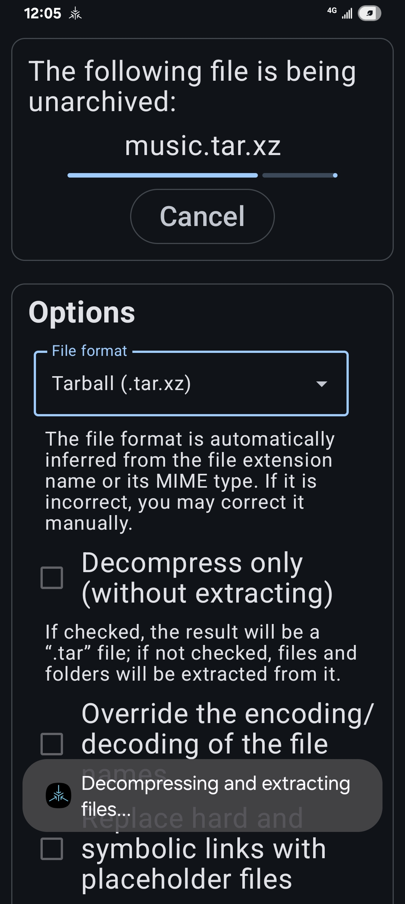
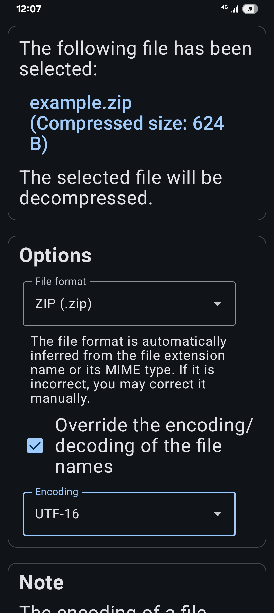
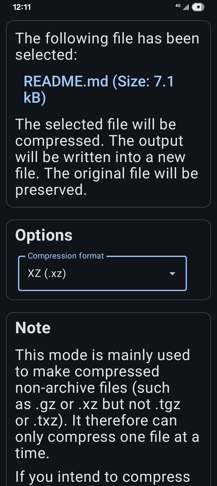

# Fundamental Compressor

**Fundamental Compressor** is a mobile app for working with files of compression and archive file formats, including those compression-only, non-archiving formats, such as `.gz` and `.xz`, and those archiving-only, non-compression formats, such as `.tar`, and those not only compress but also archive, such as `.zip` and `.7z`. In addition, it strictly follows the principle of least privilege; it uses the Storage Access Framework (SAF) to access files, and it therefore does **not** require the permission of managing all your files or that of reading/writing the storage, to perform its work.

It follows the old philosophy that a program shouldn't be able to do too many things, which, combined with the principle that a program shouldn't be granted more permission than what it needs for performing its work, largely enchances security.

Therefore, this app can only be used to compress, decompres, archive or unarchive files, but not manage nor browse them. Instead, you use the system's UI to pick a file for this app to access.

This app strictly distinguish between "compression" and "archiving", and between "decompression" and "unarchiving"; it enables you to decompress a `.tar.gz` file and get a `.tar` file, without extracting any file from the TAR archive. (You may also choose to decompress and extract at once if you prefer that.) It brings back the flexibility we once had in the days in which a program should do only one thing.

Last but not least, this app supports overriding the encoding/decoding of the names of files in an archive when extracting, so as to prevent tofu (i.e. incorrectly decoded characters).

For a better summary of what this app can do, see [functionality](#Functionality).

### Screenshots

### Functionality

This app can:

* Compress a single file, either with a compression-only, non-archiving format (e.g., `.xz`), or with a format that is not only a compression format but also an archiving format (e.g., `.zip`).

    * If the selected file has an extension name (the part of a file name after a dot, e.g., `.txt`, `.mp4`), the default name of the created file will contain one more (e.g., `*.txt.gz`, `*.txt.xz`, `*.mp4.gz`, `*.mp4.xz`); if the selected file doesn't have an extension name, the new suffix will still be appended to the name of the created file.

* Uncompress a compressed file, and optionally unarchive it if the compressed file is a TAR archive.

    * If the name of the selected file is `myfile.txt.gz`, the default name of the output file will be `myfile.txt`.

    * If the name of the selected file is `myfile.mp4.xz`, the default name of the output file will be `myfile.mp4`.

    * If the name of the selected file is `myarchive.tar.gz` or `myarchive.tar.xz`, and the decompression-only mode is enabled, the default name of the output file will be `myarchive.tar`.

    * If the name of the selected file is `myfile.gz` or `myfile.xz`, the default name of the output file will be `myfile` (with no extension name).

    * If the selected file has no extension name, and the decompression-only mode is enabled, you decide the output file name.

    * If the selected file is an archive, and the decompression-only mode isn't enabled, files will be extracted from the archive, and their names will be the names recorded in the archive.

* Archive (and possibly also compress) a folder, either with an archiving-only format (e.g., `.tar`) or with a format that is not only a compression format but also an archiving format (e.g., `.zip`), and optionally compress it if it is not yet compressed.

* Unarchive an archive and extract files from it. You can't selectively extract files. (Selective extraction is currently not implemented, and might not be implemented.)

    * This app supports overriding the encoding/decoding of the names of files in an archive, to prevent tofu (unreadable characters, usually the result of using incorrect encoding to encode/decode file names). This is currently only supported when unarchiving but not when archiving.

### Note

* This app's UI, along with the way it uses the system's APIs, is a little counterintuitive. (This is the result of not sacrificing security for convenience, so it is unlikely to change.)

* When compressing a single file, or when decompressing a file of a compression-only, non-archiving format, this app only gains the temporary permission of reading the user-selected input file and the temporary permission of writing to a created output file in the folder selected by the user. It can't access other files.

* When archiving a folder, this app will gain the temporary permission of accessing (reading and writing) files and subdirectories in the user-selected input folder (Curretly, there isn't an API to gain read-only access to a directory), and the temporary permission of writing to a created output file in the folder selected by the user, and this app will archive **all** files and subfolders that are in the folder selected as the input.

* When extracting from an archive, this app will gain the temporary permission of reading the user-selected input file (the archive file), and the temporary permission of accessing the user-selected output folder, and it will write extracted files and directories **directly under** the selected directory. It will not create a new subdirectory unless the archive contains one. The reason is that, if it creates and only writes to a subdirectory, it violates the principle of least privilege (or its (twisted) version which this app is following): if it writes only to a subdirectory, it doesn't need the access to the parent directory, and if it doesn't need to access the parent directory, it shouldn't be granted the permission to access it. Therefore, it is recommended that you choose (or create and choose) an empty directory each time.

* When compressing/decompressing/archiving/unarchiving, this app's UI can become very slow, because it might be running code on the same thread. It is not a bug, at least not an unexpected behavior.

* This app can work alone, but it is just like a program that does only one thing, so you usually need to use it with your system's default file browser, or with an installed custom file browser.

* This app supports many formats (except `.rar`, which isn't currently support and might not be supported in the future), including most compression-only format (i.e. one-file compression formats, such as `.gz` and `.xz`; for both compression and decompression), and it can decode basically all encodings supported by your device / operating system (only when decoding file names, as this app doesn't process the file contents in a way that would involve decoding the file content as text); if you can't find a format/encoding in the list, try scrolling down; there might be more options hidden.

* Some format combinations, such as `*.zip.gz` and `*.7z.xz`, aren't directly supported by this app. Instead, they are *indirectly* supported. If the file is truly compressed twice, you may try decompressing it twice with this app (by using this app twice; the first time on the original file, the second time on the result of the first time). Similarly, one can indirectly create a file of such format by using this app twice.

* When you use this app to decompress/unarchive a file, this app will try to automatically infer the compression/archive format of that file, but it isn't always correct (For example, if you store a file as `myarchive.tar.xz` in a directory containing a file of the same name, the system can add a number between the file's base name and its extension name to prevent conflicts, and the next time you open it, only the last part (`.xz`) is recognized.), so you can also override this format to ensure correctness; however, if you choose the wrong format, the result will be incorrect, and this app might not show an error about that.

* This app only uses the temporary permissions to access files; it doesn't use persistable permissions.

* This app can't access and doesn't use the network.

* The permission of posting notifications is optional.
